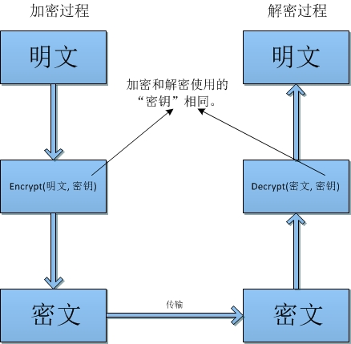

## 对称加密算法

对称密码系统与编解码类似，只不过编解码基于公开的字符序列，而对称密码体系的保密则依赖于密钥的保密。通讯双方都使用同一密钥进行数据的加密和解密，对于公开的对称加密算法而言，只要能拿到密钥就可以对密文进行解密。



**对称加密算法的安全基于密钥的保密，所以密钥的安全与否决定了加密信息的安全！**

虽然说**对称加密算法**不适用于安全要求较高的场合，对是对于一般应用来说，这已经足够了。与此同时，对称加密的速度远由于非对称加密，所以还是很多场景适用对称加密。

对称加密的速度比公钥加密快很多，在很多场合都需要对称加密。

## 常用对称加密算法

常用的对称加密算法如下：

### 数据加密标准算法：DES

DES（Data Encryption Standard）是基于56位密钥的对称加密算法。然而DES已被证明不安全。不再累赘介绍！

### 三重DES：DESede

3DES（TDEA，Triple Data Encryption Algorithm）是三重数据加密算法（TDEA，Triple Data Encryption Algorithm）块密码的通称。它是DES对称加密算法的改良版，在DES基础之上增加了密钥的长度，为原来的三倍，例如Java支持56位密钥的DES算法，则3DES的密钥则为56 * 3 = 168位。3DES骨子里还是使用的DES的算法实现。

### 高级数据加密标准：AES

AES（Advanced Encryption Standard，高级数据加密标准）是作为DES的替代者出现的。AES无论从安全性、性能都要远优于DES和3DES。AES的密钥供长度可以是128位、192位或256位。密钥长度越大，安全性越高，而加密和解密性能则越低。

### 国际数据加密标准：IDEA

IDEA（International Data Encryption Algorithm，国际数据加密标准）是在DES算法的基础上发展出来的，类似于三重DES。IDEA采用128位长度的密钥。目前还没有针对IDEA的有效攻击算法。IDEA算法被广泛用于电子邮件加密。

## 代码示例


###  密钥生成
```Java
KeyGenerator keyGenerator = KeyGenerator.getInstance("AES");
keyGenerator.init(256);
Key key = keyGenerator.generateKey();

System.out.println(Base64.getEncoder().encodeToString(key.getEncoded()));
```

### 加密

### 解密

##  参考资料
* 密码学：http://zh.wikipedia.org/wiki/%E5%AF%86%E7%A2%BC%E5%AD%B8
* 经典密码：http://zh.wikipedia.org/wiki/%E7%B6%93%E5%85%B8%E5%AF%86%E7%A2%BC
* DES：http://zh.wikipedia.org/wiki/%E8%B3%87%E6%96%99%E5%8A%A0%E5%AF%86%E6%A8%99%E6%BA%96
* 3DES：http://zh.wikipedia.org/wiki/3DES