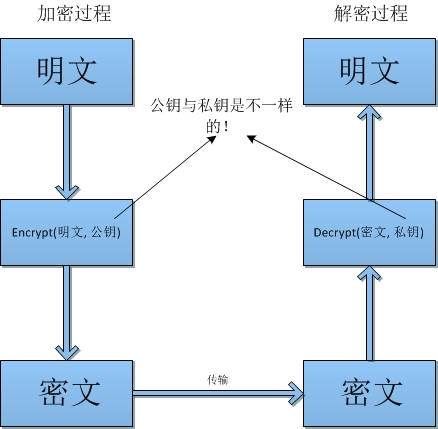

##28.1 非对称加密算法

**非对称加密算法**与**对称加密算法**的区别在于：对称加密算法加密与解密使用的密钥是相同的，而非对称加密算法的加密与解密使用的密钥是不相同的，在这两个密钥中，一个公开，成为**公钥**，一个保密，成为**私钥**。

在**非对称加密算法**中，公钥与私钥是成对存在的，公钥和私钥均可用于加密和解密。使用公钥加密的密文只有对应的私钥才能解密，而使用私钥加密的密文只有对应的公钥才能解密。用公钥加密的密文即使使用公钥本身也无法解密，私钥也同理。

##28.2 常用非对称加密算法

###28.2.1 典型非对称加密算法：RSA

RSA算法密钥的长度为512位至65535位之间，且必须是64的倍数。Java6默认的RSA算法的密钥长度是1014位。

###28.2.2 常用非对称加密算法：EIGamal

EIGamal算法密钥的长度为160位至16384位之间，且必须为8的倍数。Java没有默认对EIGamal算法的实现。如果需要使用GIGmal算法，可以使用Bouncy Castle的实现。

##28.3 代码示例

###28.3.1 密钥生成

###28.3.2 加密

###28.3.3 解密

##28.4 参考资料 